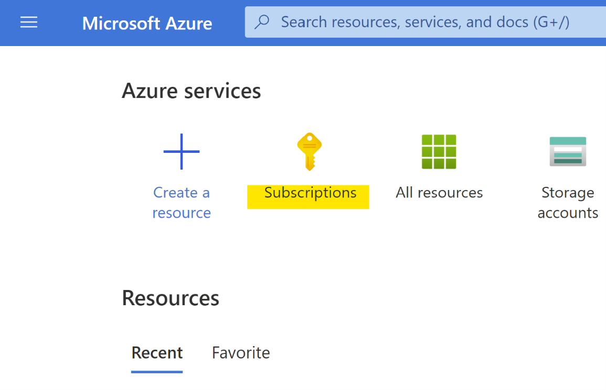
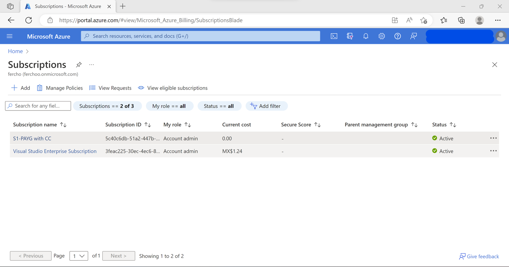
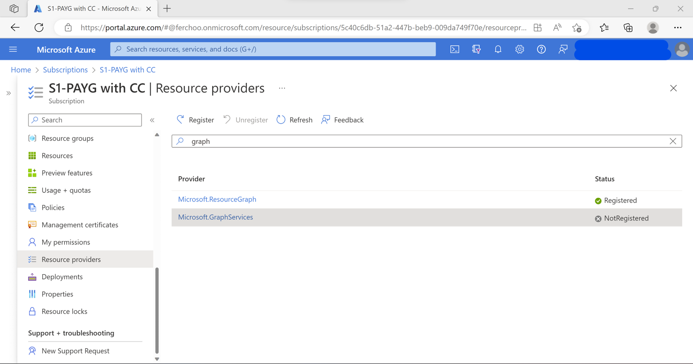
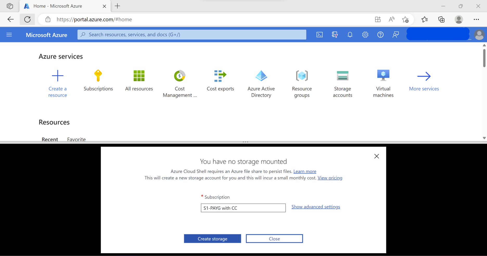

# Onboard to Microsoft Graph Metered APIs

Some APIs included in the Microsoft Graph are metered and require payment for use. 

Examples of APIs that are currently metered include:
- Teams chat / channel export
- Teams chat / channel change notifications
- Teams conversationMember change notifications
- Teams chat / channel message PATCH operations
- SharePoint assignSensitivityLabel

To consume metered APIs, the Azure Active Directory registration for the application consuming the APIs must be associated to an Azure Subscription which will be billed for any consumption related charges. These instructions will outline the process of completing this association.

## Prerequisites for accessing metered APIs
Before accessing metered APIs, you must complete the following prerequisite steps:
- Create an application registration in Azure Active Directory for the application that will be making calls to the metered APIs in Microsoft Graph.
- The target application must be a confidential client application (for example, web app, web API, or daemon / service). Public client applications are not supported (desktop apps, mobile apps).
- Create an Azure Subscription in the same tenant as the application registration.
- Make sure that you have permissions for managing both the application registration and the Azure Subscription you wish to use.
- If the APIs you plan to use are Protected APIs, submit the [request form for Teams](teams-protected-apis.md) or [request form for SharePoint](https://aka.ms/PreviewSPOPremiumAPI) depending on which APIs you are calling.

## Enabling an app
Application owners can enable their apps to consume metered APIs by associating their app to an Azure Subscription by creating an Azure ARM resource type (Microsoft.GraphServices/accounts) in the Azure Subscription that will be used for billing. The Azure ARM resource will map 1:1 with an Azure Active Directory app registration. Creating the assocation will enable the following Azure Cost Management and Billing experiences: Cost Analysis, Budgets and Alerts, and Export CSV.

Use the following steps to create and link a Microsoft.GraphServices/accounts Azure Resource to your application:
1. Sign in to https://portal.azure.com
2. Go to Subscriptions or open [Subscriptions - Microsoft Azure](https://portal.azure.com/#view/Microsoft_Azure_Billing/SubscriptionsBlade)

3. On the **Subscriptions** page, choose the subscription that you will use for your API consumption charges.

4. When the subscription opens, on the left pane choose Resource Providers, search for "graph", select **Microsoft.GraphServices**, and choose Register.

5. Go back to the home page, choose **Cloud Shell**, and then choose **Bash**.

Note: If you're using Cloud Shell for the first time you might need to create a storage account.  Select an Azure subscription, choose **Create** and follow the instructions to create a storage account.

6. Copy the command below, paste into Cloud Shell and replace the highlighted text with your own value, type <**Enter**>. The result will be a JSON representation of your Microsoft.GraphServices/accounts resource.

```Cloud Shell
az resource create --resource-group myRG --name myGraphAppBilling --resource-type Microsoft.GraphServices/accounts --properties  "{\"appId\": \"<GUID>\"}" --latest-include-preview --location Global –subscription <GUID>
```


## Consuming metered APIs in your app
After you enable metered APIs for your application, the application can successfully make API calls for metered APIs, and charges accrue in the associated Azure subscription where you created the Microsoft.GraphServices/accounts resource. If you have not completed the above steps, calling metered APIs may result in a `402 Payment required` error code being returned.

When API calls generate billing records, those records will be available in the Azure Commerce Experience.

## Receiving a bill for Microsoft Graph Services
After the subscription billing cycle runs, typically on the 5th day of the month, a subscription owner or users with role-based permissions can download an invoice. For details, see [View and download your Azure invoice | Microsoft Docs](https://docs.microsoft.com/azure/cost-management-billing/understand/download-azure-invoice).
The invoice will include the following elements: Service Family, Service Name, Meter Category, Subcategory, consumed qty, included qty, price, and extended amount. For more details, see [Understand your Azure invoice | Microsoft Docs](https://docs.microsoft.com/azure/cost-management-billing/understand/understand-invoice).
